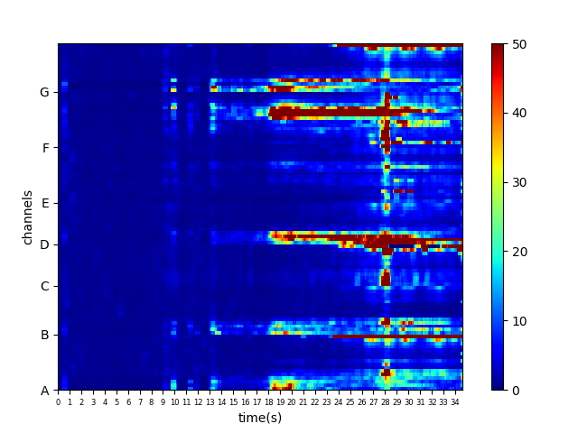
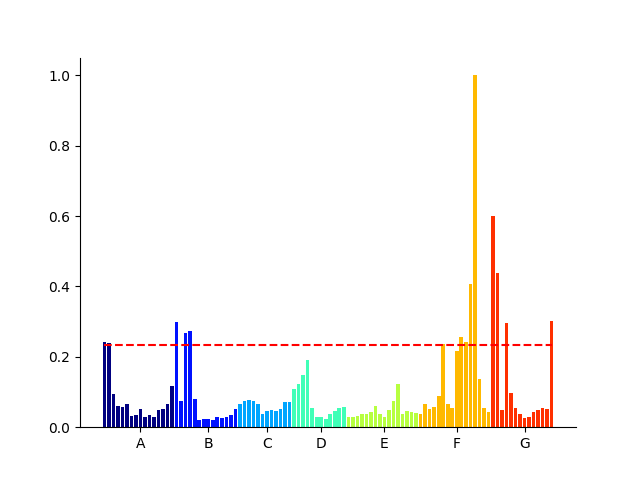

# Full-band-EZ
Code for a tool for the localization of epileptogenic zone based on full band features of stereo-EEG signal in patients with epilepsy, as described in the original paper: *Localization of Epileptogenic Zone Using Full-band Features of SEEG*.
### Quickstart
This repository requires python3.6. Install the dependencies from PyPI:
```python
pip3 install -r requirements.txt
```
To reproduce the major results reported in the paper, download the data from this [link](https://github.com/TongZhh/BrainQuake/raw/master/data). put it under the data directory. Then simply run the notebook *main_fig.ipynb*.<br>
If you want to see the original signal and time-frequency map of any channels by pressing on these three figures, you can also download and run another version with interaction:
```python
python3 main.py
```
### High Frequency Epileptogenicity Index
High frequency epileptogenicity index(HFEI) is a simplified version of epileptogenicity index(EI), which is a quantitative measure proposed by Bartolomei.The method combined spectral and temporal properties of high frequency activities during seizure onset. <br>
First, a 35-senconds signal was chosen and a band-pass FIR was used to obtain signals in the gamma and high-gamma of both ictal and baseline. Then, the band-passed SEEG signal was transformed into the high-frequency energy by amplitude squaring and window smoothing for each channel. The ictal high-frequency energy was normalized by dividing the average value of high-frequency energy of the baseline. The normalized high-frequency energy was shown:<br>
<br>
We calculate time coefficient (TC) and energy coefficient (EC) according to the normalized high frequency energy (NHFE). TC of each electrode was defined as the reciprocal of order of the onset time Nk. The higher TC represented the earlier onset of the channel. Taking the first Nk as the seizure onset time N0, EC was defined as the normalized high frequency energy during a 250ms period after N0. The higher the EC, the higher the high-frequency energy of the channel at seizure onset. We supposed the channels inside the EZ has earlier onset (TC) and higher energy (EC) of high-frequency activity at the onset. HFEI of each channel was calculated as the product of TC and EC:<br>
<br>


### Support
If you have a question or feedback, or find any problems, you can contact us by [email](mailto:zhaotongztzt@gmail.com) or open an issue on GitHub.
